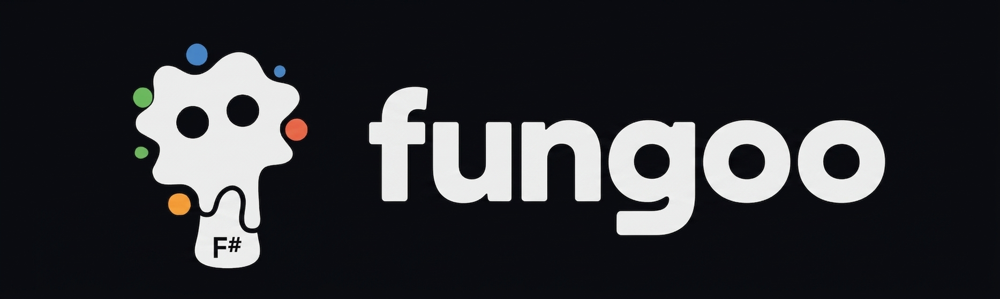

<p align="center">
  
</p>

# FunGoo

F# helpers and bindings for [Goo](https://github.com/obselate/goo), a retained desktop UI framework rendered with Vulkan.

Goo is authored in G#. FunGoo is a thin layer of ease-ups for consuming it from F#, without hiding the framework:

- **Children helpers** — append blobs to `Container` and `Button` in one call, from a sequence or inline.
- **Fluent setters** — chain configuration on the mutable Goo surface (`Window`, `TextEditorController`, `ShaderEffect`).
- **Interop helpers** — `voption` wrappers for `Try*` out-parameter methods, and inline conversions for `Length` and `Color`.
- **Virtual lists** — F# bindings for Goo's virtualized collections over an `IReadOnlyList`, a sequence, or a count and indexer.

## Getting started

Install the packages:

```sh
dotnet add package Goo
dotnet add package FunGoo
```

Describe your UI with plain F# values:

```fsharp
open Goo
open FunGoo.Children

let view =
  Container(Width = Length.Percent 100, Padding = 24, Gap = 12)
    .Children(
      Text(Content = "Hello from F#", FontSize = 24),
      Button(OnClick = fun _ -> printfn "clicked")
        .Children(Text(Content = "Click me"))
    )
```

See [samples/RaznorGoo](samples/RaznorGoo) for a complete media player: Goo widgets, adaptive state, LibVLCSharp audio, runtime SVG icons, and a custom file picker.

## Building

Requires the .NET 10 SDK.

```sh
dotnet tool restore
dotnet build
dotnet run --project samples/RaznorGoo
```

## License

MIT — see [LICENSE](LICENSE).
